# Repository Analysis: Frontend Admin Dashboard

This analysis covers the current implementation of the **Frontend Admin Dashboard** within the Warehouse Management system, contrasting it against the backend database schemas, API capabilities, and expected Admin governance responsibilities.

---

## Executive Summary

The frontend application currently implements a client-side mock framework for the **System Admin** role. Although there are pages built for system diagnostics, settings, audit trails, and user management, they run primarily on mock/stub client-side state (`WarehouseContext.jsx` and `AuthContext.jsx`) and query simulated endpoints hosted on an external Wiremock service (`https://0jejz.wiremockapi.cloud`) instead of the local Django REST Framework backend.

Crucially, **Warehouse Structure Management** (Warehouses, Zones, Racks, Shelves, Bins) is currently restricted to the **MANAGER** role in the frontend routing, and the warehouse entities are incomplete (missing **Zone Groups** and **Aisles** at both frontend and database layers). Furthermore, the **Reports** module is represented by a simple template for managers, and is completely absent for administrators.

---

## 1. Current Admin Dashboard Review

The Admin Command Center (`src/pages/admin/AdminDashboard.jsx`) is the entry point for system administrators.

### Existing KPI Cards & Widgets (Relevant)
*   **KPI Cards**:
    *   *Total Registered Users* (static mock value of `4`)
    *   *Active System Users* (static mock value of `4`)
    *   *Security Roles Active* (static value of `4`)
    *   *Total Sessions Today* (static mock value of `24`)
    *   *Failed Login Retries* (static value of `0`)
    *   *System Service Status* (static value of `99.9%` operational)
    *   *Audit Logs Generated* (linked to client-side audit logs length)
    *   *Access Alerts Pending* (static value of `0`)
*   **Administrative Core Actions**: Launcher containing shortcuts to User Management, Role Management, Audit Logs, System Health, and Settings.
*   **User Activity Audits Table**: Sub-table pulling from a mock activity trace ledger.
*   **Security Group Distributions**: Progression bars showing relative proportions of registered access credentials (ADMIN, MANAGER, STAFF, CLERK).
*   **Access Control Audits**: Static list displaying mock MFA and SSL TLS handshake events.

### Incorrect & Placeholder Widgets
*   **Service Core Overview Widget**: Renders a list of microservice latencies (Gateway API: `14ms`, Postgres DB: `3ms`, OCR Parser: `240ms`, AI Recommendations: `182ms`, React Server: `1.2ms`). This list is **entirely hardcoded** and does not perform active HTTP health handshakes to local services.

### Missing Widgets
*   **Warehouse Capacity & Spatial Metrics**: No metrics or graphs showing warehouse sites count, zones, racks, or occupied bins. Since the Admin is responsible for Warehouse Structure Management, these summaries are critical.
*   **Reports Summary Widget**: No summary or telemetry detailing system activity summaries (RAG database usage, OCR document volumes, user session rates).
*   **Security Intrusion Warning Indicator**: Lacks a real-time monitor for API transaction failures, blocked IP handshakes, or unauthorized role transitions.

---

## 2. Warehouse Structure Module Analysis

The physical storage hierarchy is defined as: 
`Warehouse` ──> `Zone Groups` ──> `Zones` ──> `Racks` ──> `Shelves` ──> `Aisles` ──> `Bins`

### Hierarchy Representation in the System
The current system has a major structural discrepancy:
1.  **Zone Groups**: **Missing entirely**. Neither the Django backend models (`apps/zones/models.py`) nor the React components contain a "Zone Group" data object or configuration interface.
2.  **Aisles**: **Missing as structural entities**. There is no Aisle model. Aisles are handled only as static text labels within pathfinding routes (e.g. `"Receiving Dock -> Aisle 1 -> Zone C"`), staff scanners (`A1`, `A2` strings), and congestion charts. They cannot be created, updated, or deleted as objects.
3.  **Active Pages**: In the frontend, the pages that manage layout structure (`Warehouse.jsx` and `ZonesBins.jsx`) are assigned to the **MANAGER** role. The Admin sidebar does not expose any of these structure controls.

### Page-by-Page Analysis

| Structure Page / Entity | Current Frontend Status | Available Actions | Missing Actions | Missing Data Fields / Discrepancies |
| :--- | :--- | :--- | :--- | :--- |
| **Warehouse** (`Warehouse.jsx`) | Manager Role Route | Search, Add Warehouse, View details drawer | Edit properties, delete facility | No CAD file management (backend has layout upload `POST /api/layout/upload`), no Zone Group/Aisle indicators. |
| **Zone Groups** | **Missing** | None | Create/List/Edit/Delete Zone Groups | No model or view exists in frontend or backend. |
| **Zones** (`ZonesBins.jsx` - Tab 1) | Manager Role Route | Search, Add Zone, Edit, Delete | Bulk importing, visual coordinate mapping | Boundary vertices coordinates (polygons) are missing from forms (backend has `ZoneBoundary` polygon coordinates, frontend only takes simple X/Y/Z). |
| **Racks** (`ZonesBins.jsx` - Tab 2) | Manager Role Route | Search, Add, Edit, Delete | Visual rack mapping, slotting rules | Form inputs only support Rack Code and Max Weight. Coordinates (x, y, z), dimensions (w, h, d), and rotation angle are present in backend `Rack` model but missing in frontend. |
| **Shelves** (`ZonesBins.jsx` - Tab 3) | Manager Role Route | Search, Add, Edit, Delete | Reordering shelves, bulk rack-to-shelf setups | Form lacks "Height from ground" input field (present in backend `Shelf` model). |
| **Aisles** | **Missing** | None | Create/List/Edit/Delete Aisles | No structural model exists. Only exists as hardcoded strings in routes. |
| **Bins** (`ZonesBins.jsx` - Tab 4) | Manager Role Route | Search, Add, Edit, Delete | Multi-bin copy/creation, product assignment | Bin coordinates (x, y, z) are generated randomly in client context but not exposed in the forms. |

---

## 3. User & Role Management Analysis

Governing user accounts and security scopes is an admin-specific workflow.

### User Management (`UserManagement.jsx`)
*   **Existing Implementation**: Flat database-like grid showing user credentials, assigned security role, assigned warehouse, account status (Active/Inactive), last sign-in, and created date. Modals support creating new users and modifying profiles.
*   **Backend Integration**: **None**. It manipulates local array variables (`workers`) within the local React state, which triggers client-side audit logs. It does not call the DRF endpoints.
*   **Available Backend APIs**:
    *   `GET /api/users/` (List all users)
    *   `POST /api/users/` (Provision new user credentials)
    *   `GET /api/users/{id}/` (Retrieve specific user details)
    *   `PUT/PATCH /api/users/{id}/` (Update fields: role, email, warehouse)
    *   `DELETE /api/users/{id}/` (Destroys credentials)
*   **Missing Features**:
    *   No separate "User Details" overview screen (only simple row edits).
    *   No actual password reset mechanism (button fires a static success alert instead of hitting an email/auth trigger).

### Role Management (`RoleManagement.jsx`)
*   **Existing Implementation**: RBAC policy editor showing scopes (`sys:config`, `user:write`, `user:read`, `wh:write`, `wh:read`, `inv:write`, `inv:read`, `agv:control`) togglable per role.
*   **Backend Integration**: **None**. Policies are mock configurations defined in local state variables (`rolesPermissions`).
*   **Discrepancy**: The backend does not have separate tables or endpoints for custom permission toggles. The backend uses Django's default group policies or simply maps roles directly inside views (e.g. checking `user.role == 'ADMIN'`).

---

## 4. System Monitoring Analysis

The system health center (`SystemHealth.jsx`) is intended to monitor service states.

*   **Existing Implementation**: Displays average gateway latency, transactions pool, and CPU load. A sub-table displays status and latency statistics for Gateway API, CockroachDB, PaddleOCR, and ONNX AI models.
*   **Backend Integration**: **None**. System Health is entirely mock. Reloading handshakes uses a `setTimeout` of 1.5 seconds and returns static variables.
*   **Missing Integrations**:
    *   **RAG Service Health**: Completely absent from the health checks grid.
    *   **Qdrant Status**: Completely absent (backend has Qdrant connection configurations at `http://localhost:6333` but frontend has no indicator).
    *   **OCR Service Health**: Monitors PaddleOCR as a mock list row, but does not fetch its status.
*   **Backend Telemetry Endpoints**: Missing. The Django backend contains no view logic or endpoints (such as `/api/health/`) to query service latencies, container metrics, or database telemetry.

---

## 5. Reports Module Analysis

The Admin is responsible for downloading operational logs.

*   **Existing Implementation**: A placeholder list (`Reports.jsx`) is assigned to the MANAGER. It lists Inbound Receipts, AGV Paths, and Stock Audits. Clicking download fires a browser alert saying: `'Report download pending backend API registry compilation.'`
*   **Missing Admin Screens**: The admin side has **no reports page at all**.
*   **Missing Reports**:
    *   **Occupancy Reports**: Trend analytics showing historical storage fill-rates by zone/rack.
    *   **User Activity Reports**: Traceable logs of administrative configurations.
    *   **OCR Activity Reports**: Structured tables of parsed invoices, confidence averages, and failure ratios.
    *   **Storage Activity Reports**: Putaway task durations, forklift travel costs, and average pick times.
*   **Missing Backend APIs**: The backend lacks analytical compiler endpoints for compiling PDF/Excel spreadsheets. Endpoints like `GET /api/reports/` do not exist.

---

## 6. Sidebar Analysis

The Admin Sidebar (`src/components/layout/Sidebar.jsx` pulling from `src/data/sidebarItems.js`) is compared below against the target specifications:

### Comparison Matrix

| Target Admin Menu Items | Current Admin Menu Items | Status / Action Needed |
| :--- | :--- | :--- |
| **Dashboard** | Dashboard (`/admin/dashboard`) | Keep (repoint mock widgets to actual database APIs). |
| **Warehouse Structure** | *None* (Manager allowed only) | **Create unified menu** containing sub-routes: Warehouses, Zone Groups (new), Zones, Racks, Shelves, Aisles (new), Bins. |
| **Users** | User Management (`/admin/users`), Role Management (`/admin/roles`) | **Consolidate** into a "Users" menu group with "Directories" and "RBAC Configuration" sub-pages. |
| **System Monitoring** | Audit Logs (`/admin/audit`), System Health (`/admin/health`) | **Consolidate** into a "System Monitoring" menu group with "System Health" and "Audit Trails" sub-pages. |
| **Reports** | *None* (Manager allowed only) | **Create new module** for Admin containing Occupancy, User Activity, OCR History, and Storage metrics reports. |
| **Settings** | Settings (`/admin/settings`) | Keep (repoint settings to backend configs). |

---

## 7. API Mapping Table

The table below maps every frontend page under the system administrator's scope to its required Django REST Framework endpoint and modifications:

| Page Name | Frontend Component | Actual Backend API Endpoint | Integration Status | Missing Fields / Discrepancies | Required Changes |
| :--- | :--- | :--- | :--- | :--- | :--- |
| **Admin Dashboard** | `AdminDashboard.jsx` | `GET /api/twin/summary` `GET /api/twin/occupancy` `GET /api/dashboards/robot-tasks/` | Mocked | No real-time data flow. | Replace mock variables with fetch calls to twin summary, occupancy, and active robotic tasks. |
| **User Directory** | `UserManagement.jsx` | `GET /api/users/` `POST /api/users/` `PUT /api/users/{id}/` `DELETE /api/users/{id}/` | Mocked | Frontend uses local `workers` array. | Repoint CRUD operations to backend `/api/users/` using authentication tokens. |
| **Security Profiles** | `RoleManagement.jsx` | Custom / Group endpoints | Mocked | Toggles are mock client states. Backend lacks dynamic toggle API. | Set up a user profile serialization sync, or manage Django standard permission sets. |
| **System Health** | `SystemHealth.jsx` | *No backend endpoint exists* | Mocked | Status tables are mock lists; no active system checks. | Build a `GET /api/health/` view in Django to return Postgres, OCR, and Qdrant status. |
| **Security Audit** | `AuditLogs.jsx` | `GET /api/audit-logs/` | Partially Mocked | Pinned to local React context log array. | Query `/api/audit-logs/` viewset to display actual database mutation records. |
| **Warehouses Structure** | `Warehouse.jsx` | `GET /api/warehouses/` `POST /api/warehouses/` | Manager Only (Missing for Admin) | Coordinates, CAD upload paths are missing in layout forms. | Map route permissions to allowedRoles: `['ADMIN', 'MANAGER']`. Connect forms to backend APIs. |
| **Zones & Racks** | `ZonesBins.jsx` | `GET /api/zones/` `GET /api/warehouses/racks/` | Manager Only (Missing for Admin) | Polygon bounds (zones), dimensions (racks) are missing from forms. | Map route permissions to allowedRoles: `['ADMIN', 'MANAGER']`. Feed forms to backend endpoints. |
| **Shelves & Bins** | `ZonesBins.jsx` | `GET /api/bins/` | Manager Only (Missing for Admin) | Height (shelves), Coordinates (bins) are missing. No ShelfViewSet exists. | Create ShelfViewSet in backend. Bind bins table to `/api/bins/` endpoint. |
| **Reports Center** | *New Page Required* | *No backend endpoint exists* | Missing | Reports are not compiled in PDF/CSV format. | Create reports views in backend and add file download links to frontend UI. |
| **Settings Panel** | `WarehouseSettings.jsx` | Custom settings endpoint | Mocked | Settings modifications only update client audit logs. | Bind settings values to database configurations or global settings storage. |

---

## 8. Gap Analysis Table

This table classifies the current state of major administration features, highlighting required work to complete the frontend-to-backend integrations:

| Feature | Current Status | Backend Support | Frontend Status | Required Work | Classification |
| :--- | :--- | :--- | :--- | :--- | :--- |
| **JWT User Authentication** | Mocked | **Fully Supported** (`/api/users/login/`) | Local storage credentials check. | Integrate login form with backend token retrieval and attach bearer tokens to API headers. | **Missing Integration** |
| **User Registry CRUD** | Mocked | **Fully Supported** (`/api/users/`) | Local context state modifications. | Connect User list tables and modals to DRF UserViewSet. | **Missing Integration** |
| **Audit Trails Logs** | Mocked | **Fully Supported** (`/api/audit-logs/`) | Renders mock entries from state. | Fetch audit logs from database and populate page. | **Missing Integration** |
| **Warehouse Structure CRUD** | Mocked | **Supported** (`/api/warehouses/`, `/api/zones/`, `/api/bins/`) | Manager-only pages with client state. | Update route parameters to allow Admins. Wire zone, rack, shelf, bin actions to backend APIs. | **Missing Integration** |
| **Zone Groups & Aisles** | **Missing** | **Not Supported** | No UI components or models. | Add model schemas in backend, generate DB migrations, and create frontend listing forms. | **Missing** |
| **System Diagnostics** | Mocked | **Not Supported** (No health API views) | Hardcoded cards and latency values. | Implement backend telemetry and ping checks, and display real responses in the UI. | **Missing** |
| **Vector DB / Qdrant Status** | **Missing** | **Supported** (`integrations/qdrant_client.py`) | No indicator in System Health. | Integrate Qdrant status checking into the health endpoint. | **Missing** |
| **Reports Compile & Download** | **Missing** | **Not Supported** | No page for Admin; Manager list is static. | Implement server-side report compilation. Connect frontend to download triggers. | **Missing** |

---

## 9. Recommended Admin Dashboard Structure

To align the client console with the backend and actual user workflow, the frontend should be restructured.

```mermaid
graph TD
    subgraph Sidebar Navigation
        D[Dashboard]
        WS[Warehouse Structure]
        U[Users]
        SM[System Monitoring]
        R[Reports]
        S[Settings]
    end

    subgraph Warehouse Structure Submenu
        WS --> WS_WH[Warehouses]
        WS --> WS_ZG[Zone Groups]
        WS --> WS_ZN[Zones]
        WS --> WS_RK[Racks]
        WS --> WS_SH[Shelves]
        WS --> WS_AL[Aisles]
        WS --> WS_BN[Bins]
    end

    subgraph Users Submenu
        U --> U_DIR[User Directory]
        U --> U_RBAC[RBAC Role Toggles]
    end

    subgraph System Monitoring Submenu
        SM --> SM_HLT[System Health & Telemetry]
        SM --> SM_AUD[Security Audit Trails]
    end

    subgraph Reports Submenu
        R --> R_OCC[Occupancy Reports]
        R --> R_USR[User Activity Reports]
        R --> R_OCR[OCR Document Reports]
        R --> R_OPS[Storage Operations Reports]
    end
```

### Key UI/UX Restructuring Guidelines
1.  **Consolidate Sidebar Routes**: Group individual settings (e.g. Audit, Health, Users, Roles) into clean, collapsable nested folders to match the recommended sidebar layout.
2.  **Repoint Services to apiClient**: Migrate all local arrays in `WarehouseContext.jsx` to fetch payloads dynamically via the `apiClient` mapping to backend URLs.
3.  **Include Missing Data Fields**: Expand forms inside `ZonesBins.jsx` to take complex entries (like polygon boundaries and coordinate details) so they sync correctly with Django schemas.
4.  **Implement Health Check Handshakes**: Build a simple endpoint on the backend to ping CockroachDB, Qdrant, and OCR services, replacing static latency cards with actual latency values.
5.  **Expose Warehouse Structure pages to Admin**: Update allowed roles in `App.jsx` from `['MANAGER']` to `['ADMIN', 'MANAGER']` for `/warehouse` and `/zones-bins` endpoints.
